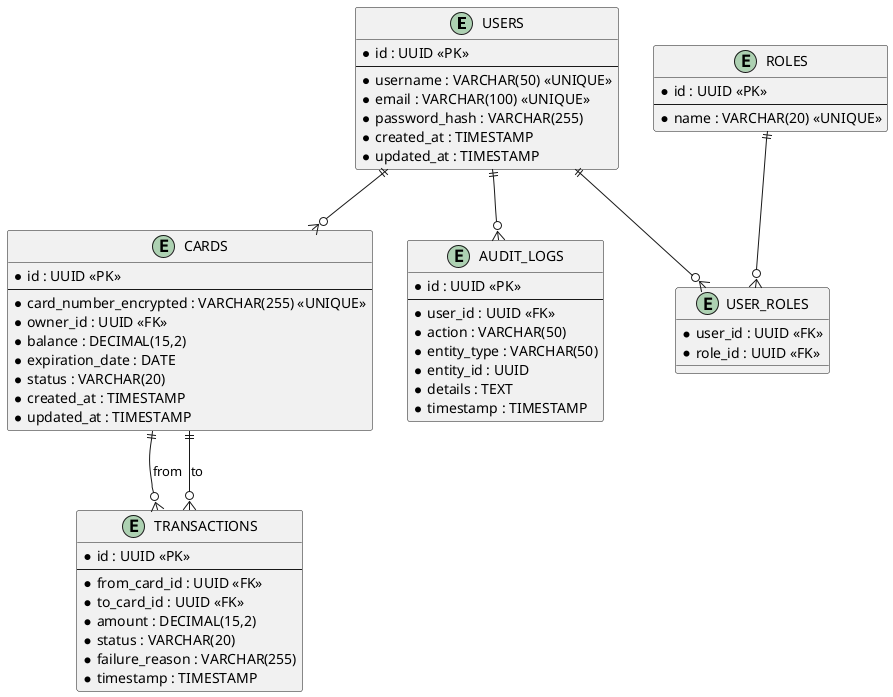

# 4. Предварительная схема базы данных

## 4.1 Общая информация

**СУБД:** PostgreSQL 16  
**Кодировка:** UTF-8  
**Схема:** public  
**Нотация:** ER-диаграмма + описание таблиц  

---

## 4.2 ER-диаграмма

```
┌─────────────────┐         ┌─────────────────┐
│     USERS       │         │      ROLES      │
├─────────────────┤         ├─────────────────┤
│ id (PK)         │         │ id (PK)         │
│ username        │         │ name            │
│ email           │         └─────────────────┘
│ password_hash   │                 │
│ created_at      │                 │
│ updated_at      │                 │
└─────────────────┘                 │
         │                          │
         │                          │
         │         ┌────────────────┴────────────┐
         │         │       USER_ROLES            │
         │         ├─────────────────────────────┤
         └─────────│ user_id (FK → users.id)     │
                   │ role_id (FK → roles.id)     │
                   └─────────────────────────────┘
         │
         │ 1
         │
         │ N
         │
┌─────────────────┐
│      CARDS      │
├─────────────────┤
│ id (PK)         │
│ card_number_enc │ (encrypted)
│ owner_id (FK)   │───────────┐
│ balance         │           │
│ expiration_date │           │ (ссылка на users.id)
│ status          │           │
│ created_at      │           │
│ updated_at      │           │
└─────────────────┘           │
         │                    │
         │                    │
         │ 1                  │
         │                    │
         │ N                  │
         │                    │
┌─────────────────┐           │
│  TRANSACTIONS   │           │
├─────────────────┤           │
│ id (PK)         │           │
│ from_card_id(FK)│───────────┘
│ to_card_id (FK) │───────────┐
│ amount          │           │
│ status          │           │ (обе ссылаются на cards.id)
│ failure_reason  │           │
│ timestamp       │           │
└─────────────────┘           │
                              │
┌─────────────────┐           │
│   AUDIT_LOGS    │           │
├─────────────────┤           │
│ id (PK)         │           │
│ user_id (FK)    │───────────┘ (ссылка на users.id)
│ action          │
│ entity_type     │
│ entity_id       │
│ details         │
│ timestamp       │
└─────────────────┘
```

---

## 4.3 Описание таблиц

### 4.3.1 Таблица: USERS (Пользователи)

**Назначение:** Хранение информации о пользователях системы (клиенты и администраторы)

| Поле | Тип | Ограничения | Описание |
|------|-----|-------------|----------|
| `id` | UUID | PRIMARY KEY, NOT NULL, DEFAULT gen_random_uuid() | Уникальный идентификатор пользователя |
| `username` | VARCHAR(50) | NOT NULL, UNIQUE | Имя пользователя для входа |
| `email` | VARCHAR(100) | NOT NULL, UNIQUE | Email пользователя |
| `password_hash` | VARCHAR(255) | NOT NULL | Хеш пароля (BCrypt) |
| `created_at` | TIMESTAMP | NOT NULL, DEFAULT CURRENT_TIMESTAMP | Дата регистрации |
| `updated_at` | TIMESTAMP | NOT NULL, DEFAULT CURRENT_TIMESTAMP | Дата последнего обновления |

**Индексы:**
- PRIMARY KEY на `id`
- UNIQUE INDEX на `username`
- UNIQUE INDEX на `email`

**Бизнес-правила:**
- Username: 3-50 символов, только буквы, цифры, подчеркивание
- Email: валидный формат email
- Password_hash: результат BCrypt с cost=10

---

### 4.3.2 Таблица: ROLES (Роли)

**Назначение:** Справочник ролей пользователей

| Поле | Тип | Ограничения | Описание |
|------|-----|-------------|----------|
| `id` | UUID | PRIMARY KEY, NOT NULL, DEFAULT gen_random_uuid() | Уникальный идентификатор роли |
| `name` | VARCHAR(20) | NOT NULL, UNIQUE | Название роли (USER, ADMIN) |

**Индексы:**
- PRIMARY KEY на `id`
- UNIQUE INDEX на `name`

**Предзаполнение:**
```sql
INSERT INTO roles (name) VALUES ('USER'), ('ADMIN');
```

---

### 4.3.3 Таблица: USER_ROLES (Связь пользователей и ролей)

**Назначение:** Many-to-Many связь между пользователями и ролями

| Поле | Тип | Ограничения | Описание |
|------|-----|-------------|----------|
| `user_id` | UUID | NOT NULL, FOREIGN KEY → users(id) ON DELETE CASCADE | Ссылка на пользователя |
| `role_id` | UUID | NOT NULL, FOREIGN KEY → roles(id) ON DELETE CASCADE | Ссылка на роль |

**Индексы:**
- PRIMARY KEY на `(user_id, role_id)`
- INDEX на `user_id`
- INDEX на `role_id`

**Бизнес-правила:**
- Каждый пользователь имеет минимум одну роль (USER по умолчанию)
- Пользователь может иметь несколько ролей (например, USER + ADMIN)
- При удалении пользователя удаляются его связи с ролями (CASCADE)

---

### 4.3.4 Таблица: CARDS (Банковские карты)

**Назначение:** Хранение информации о банковских картах

| Поле | Тип | Ограничения | Описание |
|------|-----|-------------|----------|
| `id` | UUID | PRIMARY KEY, NOT NULL, DEFAULT gen_random_uuid() | Уникальный идентификатор карты |
| `card_number_encrypted` | VARCHAR(255) | NOT NULL, UNIQUE | Зашифрованный номер карты (AES-256) |
| `owner_id` | UUID | NOT NULL, FOREIGN KEY → users(id) ON DELETE CASCADE | Владелец карты |
| `balance` | DECIMAL(15, 2) | NOT NULL, DEFAULT 0.00, CHECK (balance >= 0) | Текущий баланс (в рублях) |
| `expiration_date` | DATE | NOT NULL | Срок действия карты (MM/YY) |
| `status` | VARCHAR(20) | NOT NULL, CHECK (status IN ('ACTIVE', 'BLOCKED', 'EXPIRED')) | Статус карты |
| `created_at` | TIMESTAMP | NOT NULL, DEFAULT CURRENT_TIMESTAMP | Дата выпуска карты |
| `updated_at` | TIMESTAMP | NOT NULL, DEFAULT CURRENT_TIMESTAMP | Дата последнего изменения |

**Индексы:**
- PRIMARY KEY на `id`
- UNIQUE INDEX на `card_number_encrypted`
- INDEX на `owner_id` (для быстрого поиска карт пользователя)
- INDEX на `status` (для фильтрации по статусу)

**Бизнес-правила:**
- Номер карты: 16 цифр, проверка по алгоритму Луна, хранится в зашифрованном виде
- Баланс: не может быть отрицательным
- Срок действия: не может быть в прошлом при создании
- Статус:
  - ACTIVE: карта активна, операции разрешены
  - BLOCKED: карта заблокирована, операции запрещены
  - EXPIRED: срок действия истек, операции запрещены
- При удалении владельца удаляются его карты (CASCADE)

---

### 4.3.5 Таблица: TRANSACTIONS (Транзакции)

**Назначение:** История переводов между картами

| Поле | Тип | Ограничения | Описание |
|------|-----|-------------|----------|
| `id` | UUID | PRIMARY KEY, NOT NULL, DEFAULT gen_random_uuid() | Уникальный идентификатор транзакции |
| `from_card_id` | UUID | NOT NULL, FOREIGN KEY → cards(id) ON DELETE CASCADE | Карта-отправитель |
| `to_card_id` | UUID | NOT NULL, FOREIGN KEY → cards(id) ON DELETE CASCADE | Карта-получатель |
| `amount` | DECIMAL(15, 2) | NOT NULL, CHECK (amount > 0) | Сумма перевода |
| `status` | VARCHAR(20) | NOT NULL, CHECK (status IN ('SUCCESS', 'FAILED')) | Статус транзакции |
| `failure_reason` | VARCHAR(255) | NULL | Причина отказа (если status=FAILED) |
| `timestamp` | TIMESTAMP | NOT NULL, DEFAULT CURRENT_TIMESTAMP | Дата и время транзакции |

**Индексы:**
- PRIMARY KEY на `id`
- INDEX на `from_card_id` (для истории исходящих транзакций)
- INDEX на `to_card_id` (для истории входящих транзакций)
- INDEX на `timestamp` (для сортировки по дате)
- INDEX на `status` (для фильтрации по статусу)

**Бизнес-правила:**
- Сумма перевода: должна быть положительной
- from_card_id и to_card_id: должны принадлежать одному пользователю (для USER)
- Статус:
  - SUCCESS: перевод выполнен успешно
  - FAILED: перевод отклонен (недостаточно средств, карта заблокирована и т.д.)
- failure_reason: заполняется только при status=FAILED
- При удалении карты удаляются связанные транзакции (CASCADE)

---

### 4.3.6 Таблица: AUDIT_LOGS (Логи аудита)

**Назначение:** Системный аудит всех критичных действий

| Поле | Тип | Ограничения | Описание |
|------|-----|-------------|----------|
| `id` | UUID | PRIMARY KEY, NOT NULL, DEFAULT gen_random_uuid() | Уникальный идентификатор записи |
| `user_id` | UUID | NULL, FOREIGN KEY → users(id) ON DELETE SET NULL | Кто выполнил действие |
| `action` | VARCHAR(50) | NOT NULL | Тип действия (CREATE, UPDATE, DELETE, BLOCK, ACTIVATE) |
| `entity_type` | VARCHAR(50) | NOT NULL | Тип сущности (Card, User, Transaction) |
| `entity_id` | UUID | NOT NULL | ID сущности, с которой выполнено действие |
| `details` | TEXT | NULL | Дополнительные детали (JSON или текст) |
| `timestamp` | TIMESTAMP | NOT NULL, DEFAULT CURRENT_TIMESTAMP | Дата и время действия |

**Индексы:**
- PRIMARY KEY на `id`
- INDEX на `user_id` (для поиска действий пользователя)
- INDEX на `(entity_type, entity_id)` (для поиска действий с конкретной сущностью)
- INDEX на `timestamp` (для сортировки по дате)

**Бизнес-правила:**
- user_id: может быть NULL (для системных действий)
- При удалении пользователя его user_id в логах становится NULL (SET NULL)
- Записи в audit_logs нельзя удалить или изменить (append-only)
- Логируются действия:
  - CREATE: создание карты, пользователя
  - UPDATE: изменение данных
  - DELETE: удаление
  - BLOCK: блокировка карты
  - ACTIVATE: активация карты
  - TRANSFER: перевод средств

---

## 4.4 Связи между таблицами

### 4.4.1 Users ↔ Roles (Many-to-Many)
- Реализация: через промежуточную таблицу `user_roles`
- Один пользователь может иметь несколько ролей
- Одна роль может быть назначена нескольким пользователям

### 4.4.2 Users → Cards (One-to-Many)
- Один пользователь может иметь несколько карт
- Каждая карта принадлежит ровно одному пользователю
- При удалении пользователя удаляются его карты (CASCADE)

### 4.4.3 Cards → Transactions (One-to-Many, дважды)
- Одна карта может быть отправителем в нескольких транзакциях
- Одна карта может быть получателем в нескольких транзакциях
- Каждая транзакция имеет ровно одну карту-отправитель и одну карту-получатель
- При удалении карты удаляются связанные транзакции (CASCADE)

### 4.4.4 Users → AuditLogs (One-to-Many)
- Один пользователь может создать несколько записей в логах
- Каждая запись в логах связана с одним пользователем (или NULL для системных действий)
- При удалении пользователя его user_id в логах становится NULL (SET NULL)

---

## 4.5 ER-диаграмма в нотации Crow's Foot

```
USERS ||──o{ USER_ROLES : has
ROLES ||──o{ USER_ROLES : assigned_to
USERS ||──o{ CARDS : owns
CARDS ||──o{ TRANSACTIONS : from
CARDS ||──o{ TRANSACTIONS : to
USERS ||──o{ AUDIT_LOGS : performs
```

**Легенда:**
- `||` — ровно один
- `o{` — ноль или более
- `|{` — один или более

---

## 4.6 Диаграмма в формате PlantUML



---

## 4.7 Соответствие схемы функциональным требованиям

| Требование | Таблица(ы) | Комментарий |
|------------|-----------|-------------|
| FR-1: Регистрация | users, user_roles, roles | Создание пользователя с ролью USER |
| FR-2: Авторизация | users, user_roles, roles | Проверка пароля, получение ролей |
| FR-3: Просмотр своих карт | cards | Фильтрация по owner_id |
| FR-4: Детали карты | cards | Выборка по id |
| FR-5: Баланс карты | cards | Поле balance |
| FR-6: Перевод | cards, transactions, audit_logs | Обновление balance, запись транзакции |
| FR-7: История транзакций | transactions, cards | Выборка по from_card_id или to_card_id |
| FR-8: Запрос на блокировку | audit_logs | Запись запроса |
| FR-9: Создание карты | cards, audit_logs | Вставка в cards |
| FR-10: Просмотр пользователей | users, user_roles, roles | Выборка с JOIN |
| FR-11: Блокировка карты | cards, audit_logs | Обновление status |
| FR-12: Активация карты | cards, audit_logs | Обновление status |
| FR-13: Удаление карты | cards, audit_logs | DELETE |
| FR-14: Просмотр всех карт | cards, users | Выборка с JOIN |
| FR-15: Просмотр всех транзакций | transactions, cards | Выборка с фильтрацией |
| FR-16: Логи аудита | audit_logs, users | Выборка с фильтрацией |
| FR-17: Статистика | users, cards, transactions | Агрегатные функции (COUNT, SUM) |

---

## 4.8 Оценка размера данных

**Предположения:**
- 10,000 пользователей
- В среднем 2 карты на пользователя = 20,000 карт
- В среднем 10 транзакций на карту в месяц = 200,000 транзакций/месяц
- Логи аудита: примерно 1 запись на транзакцию + 1 запись на изменение карты = ~250,000 записей/месяц

**Размер таблиц (приблизительно):**
- users: 10,000 × 200 байт = 2 MB
- roles: 2 × 50 байт = 100 байт
- user_roles: 10,000 × 32 байт = 320 KB
- cards: 20,000 × 300 байт = 6 MB
- transactions: 200,000 × 150 байт = 30 MB/месяц
- audit_logs: 250,000 × 200 байт = 50 MB/месяц

**Итого за год:**
- Статические данные (users, cards): ~10 MB
- Динамические данные (transactions, audit_logs): ~960 MB/год

**Вывод:** Схема БД эффективна для средних нагрузок, масштабируется до миллионов записей.

---

**Заключение:** Предварительная схема БД полностью соответствует функциональным требованиям, обеспечивает целостность данных через внешние ключи и ограничения, и готова к нормализации.

